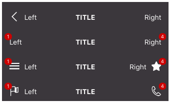

# react-native-action-bar
An Android-like action bar for react-native

For react-native v0.26+

# Example



```
import React, { Component } from 'react';
import {
    View,
} from 'react-native';

import ActionBar from 'react-native-action-bar';

export default class Example extends Component {
    render() {
        <ActionBar
            backgroundColor={'#3B373C'}
            onLeftPress={this.handleLeftAction}
            leftText={'Left'}
            title={'Title'}
            onTitlePress={this.handleTitlePress}
            onRightPress={this.handleRightAction}
            rightText={'Right'}
        />
        <ActionBar
            backgroundColor={'#3B373C'}
            onLeftPress={this.handleLeftAction}
            leftIconName={'none'}
            leftBadge={1}
            leftText={'Left'}
            title={'Title'}
            onTitlePress={this.handleTitlePress}
            onRightPress={this.handleRightAction}
            rightText={'Right'}
            rightBadge={4}
        />
        <ActionBar
            backgroundColor={'#3B373C'}
            leftIconName={'menu'}
            onLeftPress={this.handleLeftAction}
            leftBadge={1}
            leftText={'Left'}
            title={'Title'}
            onTitlePress={this.handleTitlePress}
            rightIconName={'star'}
            onRightPress={this.handleRightAction}
            rightText={'Right'}
            rightBadge={4}
        />
        <ActionBar
            backgroundColor={'#3B373C'}
            leftIconName={'flag'}
            onLeftPress={this.handleLeftAction}
            leftBadge={1}
            leftText={'Left'}
            title={'Title'}
            rightIconName={'phone'}
            onTitlePress={this.handleTitlePress}
            onRightPress={this.handleRightAction}
            rightBadge={4}
        />
    }
}
```

# Properties

Property Name | Type
--- | ---
backgroundColor | React.PropTypes.string
iconStyle | Image.propTypes.style
leftBadge | React.PropTypes.number
leftIconName | React.PropTypes.string
leftIconImage | React.PropTypes.number
leftIconStyle | Image.propTypes.style
leftText | React.PropTypes.string
leftTextStyle | Text.propTypes.style
onLeftPress | React.PropTypes.func
onRightPress | React.PropTypes.func
onTitlePress | React.PropTypes.func
rightBadge | React.PropTypes.number
rightIconName | React.PropTypes.string
rightIconImage | React.PropTypes.number
rightIconStyle | Image.propTypes.style
rightText | React.PropTypes.string
rightTextStyle | Text.propTypes.style
style | View.propTypes.style
title | React.PropTypes.string
titleStyle | Text.propTypes.style
